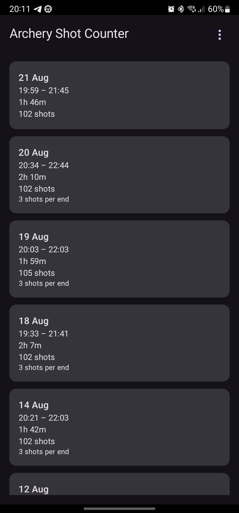
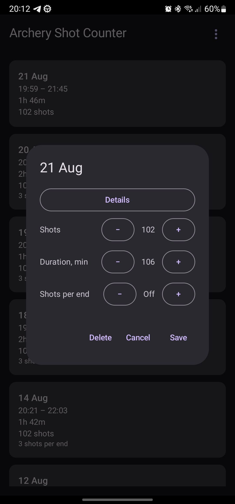
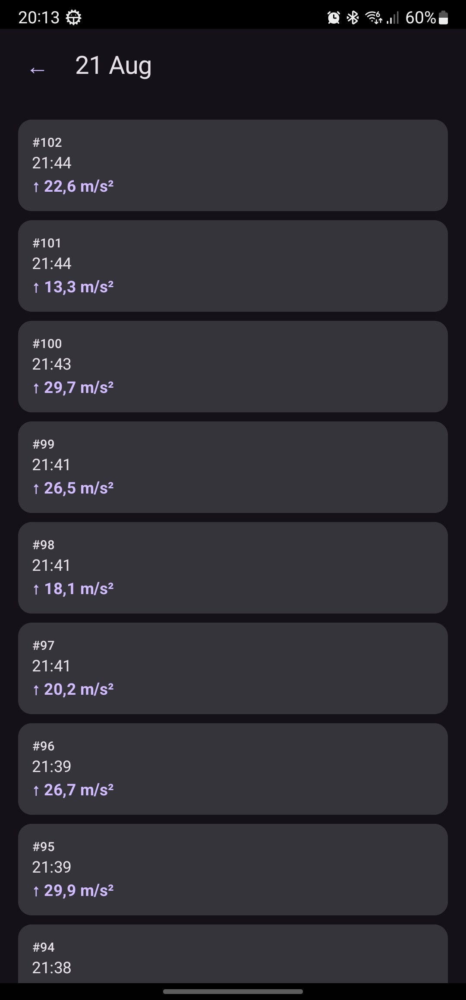

# Archery Shot Counter — Companion

The phone companion for [Archery Shot Counter](https://github.com/Vemestael/ArcheryShotCounter-wearos), a Wear OS app that automatically counts archery shots via the wrist accelerometer. This app receives your training sessions from the watch, keeps a full local history, and lets you browse, edit, back up and restore your data from your phone.

## Screenshots

  

## Features

- **Session history** — every session synced from the watch, with date, time range, duration and shot count
- **Live session tracking** — a session still in progress on the watch shows up immediately with a live indicator and shot count, updating in real time
- **Per-shot detail** — tap a session → Details to see the timestamp and impact strength of every recorded shot
- **Edit sessions** — correct the shot count, duration or shots-per-end from your phone
- **Year grouping** — older sessions are grouped under a year label as your history grows
- **Two-way sync** — pull-to-refresh or the sync button reconciles with the watch in both directions, deletions included
- **Export / import** — back up or restore your full history as JSON or CSV
- **Clear data** — wipe local data on the phone without affecting the watch
- **12 interface languages** — English, Russian, Spanish, French, German, Portuguese, Chinese, Japanese, Korean, Arabic, Turkish and Hindi

## Requirements

- Android 8.0+ (API 26+)
- Google Play services (for the Wearable Data Layer API)
- The [watch app](https://github.com/Vemestael/ArcheryShotCounter-wearos) installed and paired to sync sessions from

## Installation

Download the latest APK from the [Releases](https://github.com/Vemestael/ArcheryShotCounter-android/releases) page and install it on your phone.

```bash
adb install ArcheryShotCounterCompanion-<version>.apk
```

Or copy the APK to the phone and open it directly — you'll need to allow installs from the source the first time.

## How it works

The app talks to the watch through the Wear OS [Data Layer API](https://developer.android.com/training/wearables/data/data-layer). The watch pushes each session as a `DataItem` on every recorded shot, plus a lightweight marker for whichever session is currently in progress — the phone's live listener picks these up while the app is open, and a manual sync (button or pull-to-refresh) reconciles everything, including sessions recorded while the phone was offline.

## Building from source

```bash
git clone https://github.com/Vemestael/ArcheryShotCounter-android.git
cd ArcheryShotCounter-android
./gradlew assembleDebug
```

For a signed release build, create `keystore.properties` in the project root (not committed):

```properties
storeFile=/path/to/your.jks
storePassword=...
keyAlias=...
keyPassword=...
```

Then run:

```bash
./gradlew assembleRelease
```

## License

MIT — see [LICENSE](LICENSE).
